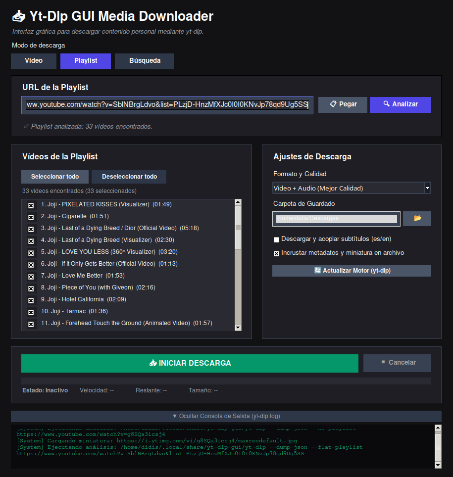
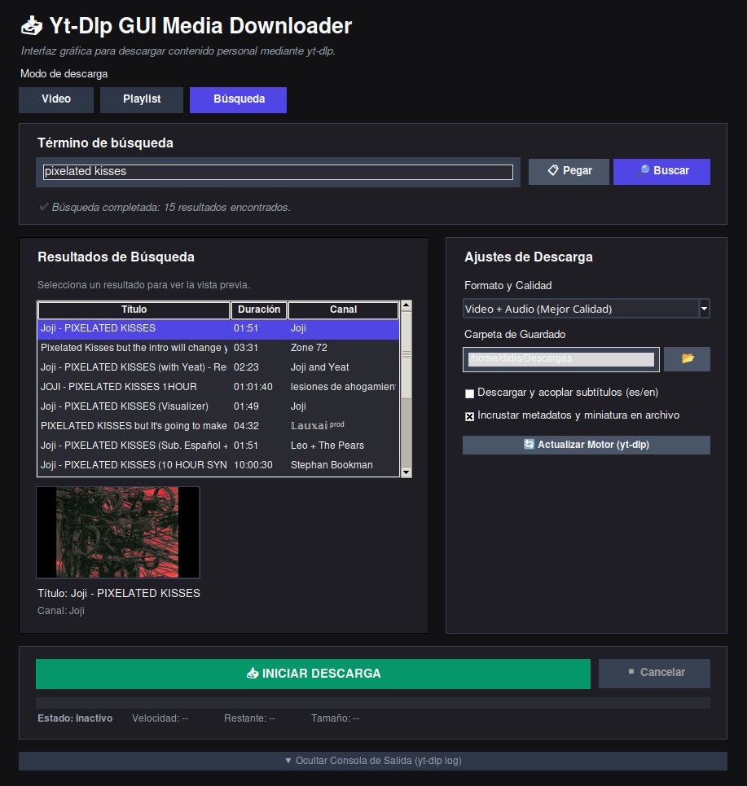

# Yt-DLP GUI

Una interfaz gráfica moderna para **yt-dlp**, desarrollada en **Python** con **Tkinter**, que facilita la descarga de vídeo y audio desde plataformas compatibles mediante una experiencia de usuario intuitiva, sin necesidad de utilizar la línea de comandos.

[]()
[]()
[](LICENSE)
[](https://github.com/yt-dlp/yt-dlp)

---

## Características

- Interfaz gráfica moderna con tema oscuro.
- **Tres modos de descarga:** vídeo individual, playlist y búsqueda.
- Análisis previo del contenido.
- Vista previa mediante miniatura.
- Información del vídeo (título, autor y duración).
- Selección individual de vídeos en playlists.
- Buscador integrado de vídeos (YouTube vía yt-dlp).
- Descarga de vídeo y audio en múltiples formatos.
- Extracción de audio.
- Descarga e incrustación de subtítulos.
- Incrustación de metadatos y miniaturas.
- Monitorización del progreso en tiempo real.
- Consola integrada con la salida de **yt-dlp**.
- Cancelación de descargas.
- Actualización automática del ejecutable de **yt-dlp**.
- Descarga automática de **yt-dlp** en el primer arranque si no está instalado.
- Pantalla de aviso legal al iniciar la aplicación.

---

## Modos de descarga

### Video

Modo por defecto. Introduce la URL de un vídeo, analízalo y descárgalo con el formato deseado.

### Playlist

Introduce la URL de una playlist, analízala y selecciona qué vídeos descargar mediante casillas de verificación. Incluye botones para seleccionar o deseleccionar todos los vídeos.

### Búsqueda

Introduce un término de búsqueda para encontrar vídeos en YouTube. Selecciona un resultado de la lista para ver la vista previa y descargarlo.

---

## Capturas

| Video | Playlist | Buscar |
|--------------------|-----------------------|----------------------|
|  |  |  |

---

## Formatos disponibles

### Vídeo

- Mejor calidad disponible
- MP4 hasta 1080p
- MP4 hasta 720p
- MP4 hasta 480p

### Audio

- MP3
- M4A
- WAV

---

## Compatibilidad

| Sistema operativo | Estado |
|-------------------|--------|
| Windows | ✅ Compatible |
| Linux | ✅ Compatible |

---

## Dependencias

### Requisitos del sistema

- Python 3.10 o superior
- **FFmpeg** (obligatorio para extracción de audio, subtítulos y metadatos)

> La aplicación comprueba la presencia de FFmpeg antes de iniciar descargas que lo requieran.

### Dependencias de Python

Dependencias de ejecución (`requirements.txt`):

```bash
pip install -r requirements.txt
```

Para compilar el ejecutable (`requirements-build.txt`):

```bash
pip install -r requirements-build.txt
```

> **Nota:** La aplicación utiliza el **binario** de yt-dlp (descargado automáticamente o disponible en el PATH), no el paquete Python de yt-dlp.

---

## Instalación

Clonar el repositorio:

```bash
git clone https://github.com/didis01/Yt-DLP-GUI.git

cd Yt-DLP-GUI
```

Instalar las dependencias:

```bash
pip install -r requirements.txt
```

Instalar **FFmpeg** y asegurarse de que se encuentra disponible en el `PATH` del sistema.

---

## Ejecución

### Linux

```bash
./run.sh
```

o

```bash
python3 yt_downloader.py
```

### Windows

```powershell
python yt_downloader.py
```

En el primer arranque, si yt-dlp no está instalado, la aplicación ofrecerá descargarlo automáticamente desde GitHub.

---

## Compilación

### Linux

```bash
chmod +x build.sh
./build.sh
```

### Windows

```bat
build.bat
```

Los scripts de compilación generan un ejecutable independiente utilizando **PyInstaller** y el archivo `yt-dlp-gui.spec`.

---

## Tecnologías utilizadas

- Python
- Tkinter
- yt-dlp
- FFmpeg
- Pillow
- Requests
- PyInstaller

---

## Flujo de uso

1. Aceptar el aviso legal al iniciar.
2. Elegir el modo: **Video**, **Playlist** o **Búsqueda**.
3. Introducir la URL, la URL de playlist o el término de búsqueda.
4. Analizar o buscar el contenido.
5. Revisar la información obtenida (y seleccionar vídeos en modo playlist).
6. Seleccionar el formato de descarga.
7. Elegir la carpeta de destino.
8. Iniciar la descarga.
9. Supervisar el progreso en tiempo real.

---

## Aviso legal

**Yt-DLP GUI** es únicamente una interfaz gráfica para la herramienta **yt-dlp**.

El usuario es el único responsable del uso del software y debe respetar la legislación aplicable, los derechos de autor y los términos de servicio de las plataformas desde las que descargue contenido.

---

## Licencia

Este proyecto está distribuido bajo la **Apache License 2.0**.

Consulte el archivo [LICENSE](LICENSE) para obtener el texto completo de la licencia.

Copyright © 2026 Diego Martínez-Blay Díaz.

---

## Agradecimientos

Este proyecto se apoya en el excelente trabajo realizado por:

- [yt-dlp](https://github.com/yt-dlp/yt-dlp)
- FFmpeg
- La comunidad de Python
