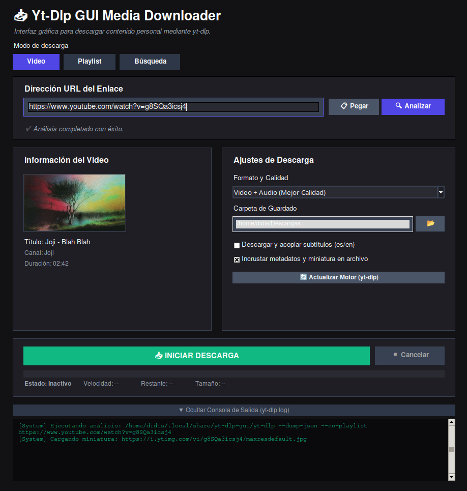

# Yt-DLP GUI

Una interfaz gráfica moderna para **yt-dlp**, desarrollada en Python con Tkinter, que facilita la descarga de vídeo y audio desde plataformas compatibles mediante una experiencia de usuario intuitiva, sin necesidad de utilizar la línea de comandos.

[]()
[]()
[](LICENSE)
[](https://github.com/yt-dlp/yt-dlp)

---

## Características

- Interfaz gráfica moderna con tema oscuro.
- Análisis de enlaces antes de iniciar la descarga.
- Vista previa mediante miniatura.
- Información del contenido (título, autor y duración).
- Descarga de vídeo y audio en múltiples formatos.
- Extracción de audio.
- Descarga e incrustación de subtítulos.
- Incrustación de metadatos y miniaturas.
- Monitorización del progreso en tiempo real.
- Consola integrada con la salida de `yt-dlp`.
- Cancelación de descargas en ejecución.
- Actualización automática del ejecutable de `yt-dlp`. :contentReference[oaicite:1]{index=1}

---

## Capturas

| Pantalla principal | Descarga | Consola |
|--------------------|----------|----------|
|  |  |  |

---

## Formatos disponibles

### Vídeo

- Mejor calidad disponible
- MP4 hasta 1080p
- MP4 hasta 720p
- MP4 hasta 480p

### Audio

- MP3
- M4A
- WAV

Los perfiles de descarga utilizan automáticamente las opciones adecuadas de **yt-dlp** según el formato seleccionado. :contentReference[oaicite:2]{index=2}

---

## Requisitos

- Python 3.10 o superior
- yt-dlp
- FFmpeg
- Pillow
- Requests

---

## Instalación

Clonar el repositorio:

```bash
git clone https://github.com/<usuario>/yt-dlp-gui.git

cd yt-dlp-gui
```

Instalar las dependencias:

```bash
pip install requests pillow
```

Instalar también:

- yt-dlp
- FFmpeg

---

## Ejecución

### Linux

```bash
./run.sh
```

o

```bash
python3 yt_downloader.py
```

### Windows

```powershell
python yt_downloader.py
```

El proyecto incluye un script de inicio para Linux. :contentReference[oaicite:3]{index=3}

---

## Compilación

### Linux

```bash
chmod +x build.sh

./build.sh
```

El script instala las dependencias necesarias y genera un ejecutable mediante **PyInstaller**. :contentReference[oaicite:4]{index=4}

### Windows

```bat
build.bat
```

---

## Tecnologías

- Python
- Tkinter
- yt-dlp
- FFmpeg
- Pillow
- Requests
- PyInstaller

---

## Flujo de trabajo

1. Introducir la URL.
2. Analizar el contenido.
3. Revisar la información obtenida.
4. Seleccionar el formato de salida.
5. Elegir la carpeta de destino.
6. Iniciar la descarga.
7. Supervisar el progreso en tiempo real.

---

## Aviso legal

Este proyecto proporciona únicamente una interfaz gráfica para la herramienta **yt-dlp**.

El usuario es responsable de utilizar el software respetando la legislación aplicable y los términos de servicio de las plataformas desde las que descargue contenido. La aplicación no está diseñada para facilitar la infracción de derechos de autor. :contentReference[oaicite:5]{index=5}

---

## Licencia

Este proyecto está distribuido bajo la **Apache License 2.0**.

Puede utilizar, modificar y distribuir este software de acuerdo con los términos de la licencia. Consulte el archivo **LICENSE** para obtener el texto completo.

Copyright © 2026 Diego Martínez-Blay Díaz

---

## Agradecimientos

Este proyecto se apoya en el excelente trabajo realizado por:

- yt-dlp
- FFmpeg
- La comunidad de Python
